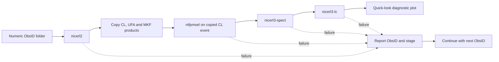

# NICERFlow

### Fault-tolerant NICER reduction and Level-3 product orchestration

[](https://github.com/varunastronomy/nicerflow-pipeline/actions/workflows/quality-checks.yml)
[](https://www.python.org/)
[](https://heasarc.gsfc.nasa.gov/docs/nicer/analysis_threads/)

NICERFlow is a Python orchestration program for processing multiple NICER observations in numerical ObsID order. It runs NICERDAS calibration and product-generation tasks, isolates failures by observation, and creates a quick-look comparison between the MKF overshoot-rate diagnostic and the source light curve.

> **Scope:** NICERFlow orchestrates external NICERDAS tools; it does not reimplement NICER calibration or screening algorithms. Scientific products remain dependent on the installed HEASoft/NICERDAS and CALDB versions, the input data, and the explicitly recorded task parameters.

## **Copyright, permission, and mandatory citation**

> **COPYRIGHT © 2026 M. VARUN, CHRIST (DEEMED TO BE UNIVERSITY), BENGALURU (BANGALORE), INDIA. ALL RIGHTS RESERVED.**
>
> **NO PERMISSION IS GRANTED TO USE, COPY, MODIFY, REDISTRIBUTE, REPUBLISH, OR INCORPORATE THIS SOFTWARE INTO ANOTHER PROJECT WITHOUT PRIOR WRITTEN PERMISSION FROM THE AUTHOR. WHEN PERMISSION IS GRANTED, CLEAR ATTRIBUTION AND CITATION OF M. VARUN AND THIS REPOSITORY ARE MANDATORY.**

## Processing sequence



## Implemented configuration

- `nicerl2 indir=./ clobber=yes`
- Copied working products are stored in `l2_products/`.
- `nifpmsel` operates in place on the copied cleaned event and uses `detlist=launch,-14,-34` with the matching MKF file.
- `nicerl3-spect` uses optimal minimum grouping and the SCORPEON background model with file-format background output.
- `nicerl3-lc` uses one-second bins, `pirange=30:1200`, SCORPEON, and FPM detector normalisation.

These are explicit analysis choices, not universal settings for every source or science goal.

## Failure behaviour

Every external command is checked. If a stage fails, NICERFlow prints:

```text
[FAILED] ObsID 1234567890 | stage: nicerl3-spect | command returned exit status 218
[CONTINUE] Moving to the next observation.
```

The final summary lists successful ObsIDs and every failed ObsID with its failing stage. A run containing any failed observation returns a non-zero program exit status.

## Requirements

- Python 3.10 or newer
- Astropy and Matplotlib
- A configured HEASoft environment containing NICERDAS
- Current NICER calibration files available through CALDB
- NICER observation folders named with numeric ObsIDs

```bash
python3 -m venv .venv
source .venv/bin/activate
python -m pip install -r requirements.txt
python Final_NICER_pipeline.py
```

HEASoft and NICERDAS are external mission software and are not installed by `requirements.txt`.

## Data safety

The event file modified by `nifpmsel` is the copied cleaned event inside `l2_products/`. The original Level-2 event under `xti/event_cl/` is retained. Existing contents of `l2_products/` and mission products generated with `clobber=yes` may be replaced, so preserve scientifically important earlier products before rerunning the pipeline.

## Validation boundary

The repository checks Python syntax automatically. Scientific runtime validation requires NICER observations, HEASoft/NICERDAS, CALDB, and an appropriate analysis environment; it has not been claimed from static inspection alone.

Official task references:

- [NICER `nicerl2` processing thread](https://heasarc.gsfc.nasa.gov/docs/nicer/analysis_threads/nicerl2/)
- [`nifpmsel` help](https://heasarc.gsfc.nasa.gov/docs/software/lheasoft/help/nifpmsel.html)
- [`nicerl3-spect` processing thread](https://heasarc.gsfc.nasa.gov/docs/nicer/analysis_threads/nicerl3-spect/)
- [`nicerl3-lc` help](https://heasarc.gsfc.nasa.gov/docs/software/lheasoft/help/nicerl3-lc.html)

## Author

**M. Varun**<br>
X-ray astronomy researcher and scientific Python developer<br>
CHRIST (Deemed to be University), Bengaluru (Bangalore), India<br>
[GitHub: varunastronomy](https://github.com/varunastronomy)
